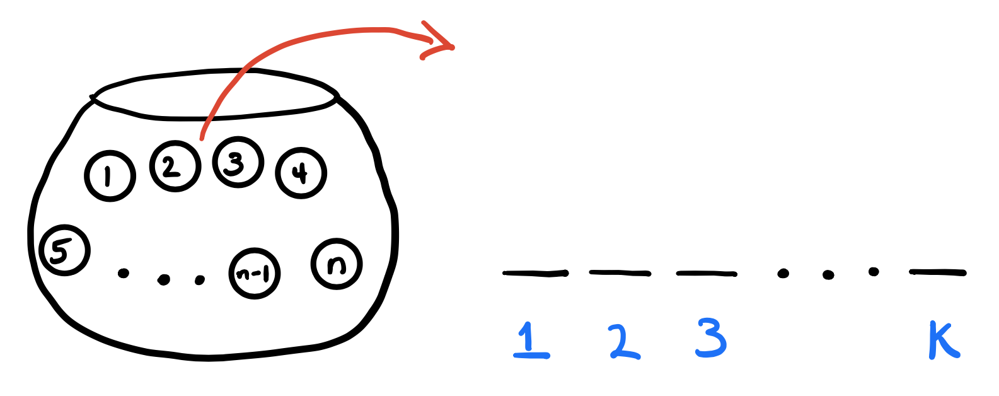
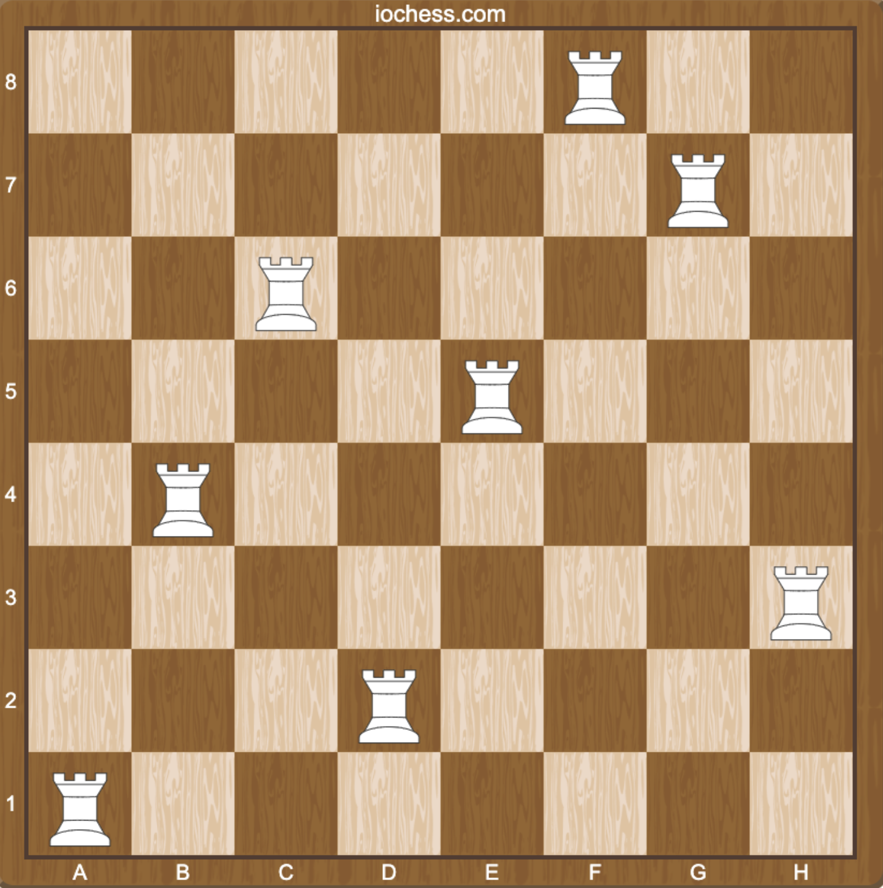

[Last week](/lab/lab-1.html), you used the `sample` function to simulate random phenomena that had a finite sample space with equally-likely outcomes: coin flips, die rolls, playing cards. Using a loop, you repeated an experiment many many times, calculated the proportion of the time some event happened, and used that proportion as an approximation of the probability. In class this week, we began talking about counting methods for actually doing the math to compute these probabilities exactly.

In this lab, you will do both of these things, the math and the simulation, and verify that they agree. The examples today are small potatoes, but these generic skills are important. Being able to whip up computer simulations of random systems is one of the main skills that will empower you to continue self-studying probability and statistics after you leave the classroom. Hardly a day goes by when myself and my colleagues don't run a simulation of some kind.

::: callout-tip
## Write-up instructions

The template for this assignment is in the Canvas files. You will submit solutions for Tasks 1 - 3 below (Task 0 is just an extra example for you to refer to). A complete solution has three pieces:

- the `R` code that runs the simulation and approximates the probability;
- the one line of code that uses `R` as a calculator to compute the exact decimal probability based on your mathematical solution;
- A lil' [math formula](/explainers/latex.html) (between double dollar signs in your .`qmd`) that summarizes the derivation of the final answer.
:::

## Background

To model a random phenomenon, we write down a **probability space**: the non-empty set $S$ containing all possible outcomes called the **sample space**, the **events** $A\subseteq S$, and the **probability measure** $P$ that assigns probabilities to the events. In order to be considered valid, we place the following requirements on $P$, the so-called **probability axioms**:

1. (**total measure 1**) $P(S)=1$;
1. (**nonnegativity**) $P(A)\geq 0$;
1. (**countable additivity**) If $A_1,\,A_2,\,A_3,\,...\subseteq S$ are pairwise disjoint, then

$$
P\left(\bigcup_{i=1}^\infty A_i\right)=\sum\limits_{i=1}^\infty P(A_i).
$$

Once you assume those three things, you can *deduce* various downstream consequences about how probability behaves in general:

| Rule | Statement |
|----------------|------------|
| **Probability of empty set** |   $P(\varnothing)=0$      |
| **Finite additivity** |   $A_1,\,A_2,\,...,\,A_n\subseteq S$ pairwise disjoint implies $P\left(\bigcup_{i=1}^n A_i\right)=\sum\limits_{i=1}^n P(A_i)$      |
| **Complement rule** |   $P(A)=1-P(A^c)$      |
| **Monotonicity** |   $A\subseteq B \,\implies\,P(A)\leq P(B)$      |
| **Inclusion/exclusion** |   $P(A\cup B)=P(A)+P(B)-P(A\cap B)$      |
| **Law of total probability** |   $P(A)=\sum\limits_{i=1}^\infty P(A\cap B_i)$ if $B_1,\,B_2,\,B_3,\,...\subseteq S$ is a **partition**     |


As Mrs. Lovett said, that's all very well, but how do you actually *use* this machinery to compute probabilities in concrete examples? In other words, how do you actually *specify* a probability measure that satisfies the axioms? Lots of ways. But let's start simple and make two extra assumptions:

a. (**finite sample space**) $S=\{s_1,\,s_2,\,...,\,s_n\}$;
b. (**equally likely outcomes**) $P(\{s_i\})=1/n$ for every outcome in $S$.

This is already a suffient model to analyze classic examples like flipping coins, rolling dice, and playing cards. If you have a finite sample space where every individual outcome has the same probability, then *finite additivity* tells you that probability collapses to a *counting problem*:


$$
P(A)=\frac{\#(A)}{\#(S)}=\frac{\text{the number of ways }A\text{ could happen}}{\text{the number of ways anything could happen}}.
$$


So, in order to compute probabilities in this simplified environment, you need to be able to count the number of elements contained inside sets. Sounds straightforward, but for better or worse, it turns out that there is more to this than meets the eye.

The main engine for counting methods is the following principle:

::: callout-note
## The counting principle

If each element in your set is determined by $p$ traits, and each of these traits has $n_1$, $n_2$, ..., $n_p$ options, respectively, then the total number of ways that you can mix-and-match the $p$ traits is:

$$
n_1\times n_2\times n_3\times ...\times n_p.
$$

**Example**: Imagine your set consists of the individual cards in a standard deck of playing cards. Each card is determined by two traits: its *suit* and its *rank*. There are four options for the suit (♠, ♥, ♦, ♣) and 13 options for the rank (A, 2, 3, ..., J, Q, K), so in total there are $4\times 13=52$ cards.
:::

When we set out to count the number of elements in a set, we will usually frame the task as a "selecting $k$ from $n$" problem:

{fig-align="center" width="50%"}

We have $n$ balls in a jar. We withdraw balls from the jar and use them to fill $k$ slots. How many ways can we draw balls from the jar of $n$ to fill the $k$ slots? This question does not have a unique answer, because it depends on two things:

- (**are we drawing with or without replacement?**) after I draw a ball from the jar to fill a slot, do I put it back in the jar so that I can potentially draw it again to fill another slot? Or after I draw a ball, is it "out of play" forevermore?
- (**does order matter?**) Say $k = 2$. I could draw (Ball 1, Ball 3) or (Ball 3, Ball 1). Do I count these as two separate outcomes because the order is different, or do I consider them the same outcome because the contents are identical? So, do I ignore or acknowledge the ordering of the draws when I count?

Depending on how you mix-and-match those two things, you get different answers to the question "how many ways can you select $k$ from $n$" Here is a summary:

::: {.center-table}
|        | order [yes]{style="color:blue;"} |   order [no]{style="color:red;"}   |
|----------------|------------|------|
| **replace [no]{style="color:red;"}**           |   $\frac{n!}{(n-k)!}$      |  $\binom{n}{k}=\frac{n!}{k!(n-k)!}$    |
| **replace [yes]{style="color:blue;"}**   |    $n^k$     |   $\binom{n+k-1}{k}$   |

: How many ways can you select $k$ from $n$?
:::

## Task 0 (review)

Consider this question from [Lab 1](/lab/lab-1.html#task-3):

> a five-card hand is randomly dealt to you from a well-shuffled deck. What is the probability that the hand contains *at least* one ace?

Last week, we didn't have the tools to do the math, but we could program a computer to approximate:

```{r}

deck_of_cards <- c("AH", "2H", "3H", "4H", "5H", "6H", "7H", "8H", "9H", "10H", "JH", "QH", "KH",
                   "AD", "2D", "3D", "4D", "5D", "6D", "7D", "8D", "9D", "10D", "JD", "QD", "KD",
                   "AC", "2C", "3C", "4C", "5C", "6C", "7C", "8C", "9C", "10C", "JC", "QC", "KC",
                   "AS", "2S", "3S", "4S", "5S", "6S", "7S", "8S", "9S", "10S", "JS", "QS", "KS")

set.seed(123)

n_rep <- 10000
counter <- 0

for (i in 1:n_rep) {
  
  hand <- sample(deck_of_cards, size = 5, replace = FALSE)
  
  if (any(hand %in% c("AH","AD","AC","AS"))) {
    counter <- counter + 1
  }
}

counter / n_rep
```


Now let's see how the math goes. The complement of the target event $A =$ "at least one ace" is $A^c =$ "no aces at all." This is simpler and may be easier to count, so we will apply the complement rule:

$$
P(A)=1-P(A^c)=1-\frac{\#(A^c)}{\#(S)}.
$$

The sample space $S$ is the set of all five-card hands you could be dealt. We are selecting $k=5$ from $n=52$. How?

- **without replacement**: once a card is dealt to you, it stays in your hand and is not available to be dealt again;
- **ignoring order**: the order in which cards are dealt to you is irrelevant. All that matters is the raw contents.


Therefore, the total number of hands that could be dealt is $\#(S)=\binom{52}{5}$. The event $A^c$ is the set of all five-card hands that do not include an ace. There are 48 non-ace cards, and so $\#(A^c)=\binom{48}{5}$. As such

$$
P(A)=1-\frac{\binom{48}{5}}{\binom{52}{5}}\approx 0.34.
$$

To get the actual number, we can use the `choose` function in `R`. Try typing this into the console:

```{r}
1 - choose(48, 5) / choose(52, 5)
```

This is close to the number we approximated via simulation. Phew!

## Task 1

- **Scenario**: roll three *fair* dice;
- **Event**: all three dice show different numbers.

::: {.callout-warning collapse="true"}
## Solution

This code simulates 7,500 trials and computes the proportion of the time the event occurs:

```{r}
set.seed(37367)

nreps <- 7500
counter <- 0

for(i in 1:nreps){
  
  rolls <- sample(1:6, 3, replace = TRUE)
  
  if( length(unique(rolls)) == 3 ){
    counter <- counter + 1
  }
  
}

counter / nreps # proportion
```

In order to do the math, we apply $P(A)=\#(A)/\#(S)$ directly. The sample space $S$ is the set of all three-dice rolls. Each die is like a  *trait* in the sense of the counting principle, so the number of ways we could mix and match the rolls is $\#(S)=6\times6\times6=6^3=216$. The target event $A$ is the set of all three-dice rolls where all numbers are different (ie. sampling without replacement), and so $\#(A)=6\times 5\times 4=120$. Putting it into `R` gives:

```{r}
120 / 216
```


We conclude then that

$$
P(A) = \frac{6\times 5\times 4}{6^3} = \frac{120}{216} \approx 0.555,
$$

which agrees with our simulation.

:::

## Task 2 

- **Scenario**: 6 balls are randomly drawn from a jar containing 5 red, 4 blue, 3 green;
- **Event**: you draw exactly 3 red or exactly 2 green.

Here is a representation of the contents of the jar that you can sample from:

```{r}
jar <- c(rep("R", 5), rep("B", 4), rep("G", 3))
jar
```

::: {.callout-warning collapse="true"}
## Solution

```{r}
#| label: task-2

set.seed(2025)
nsim <- 20000
count_event <- 0

jar <- c(rep("R", 5), rep("B", 4), rep("G", 3))

for (i in 1:nsim) {
  hand <- sample(jar, 6, replace = FALSE)
  n_red <- sum(hand == "R")
  n_green <- sum(hand == "G")
  
  if (n_red == 3 | n_green == 2) {
    count_event <- count_event + 1
  }
}

count_event / nsim
```

- $A$ = exactly 3 red, $B$ = exactly 2 green
- Both could happen so $A\cap B$ is non-empty;
- $\#(S)=\binom{12}{6}$;
- $\#(A) = \binom{5}{3}\binom{7}{3}$;
- $\#(B) = \binom{3}{2}\binom{9}{4}$;
- $\#(A\cap B)=\binom{5}{3}\binom{3}{2}4$;
- So inclusion/exclusion says that:

$$
P(A\cup B)=P(A)+P(B)-P(A\cap B)=\frac{\binom{5}{3}\binom{7}{3}}{\binom{12}{6}}+\frac{\binom{3}{2}\binom{9}{4}}{\binom{12}{6}}-\frac{\binom{5}{3}\binom{3}{2}4}{\binom{12}{6}}.
$$

Calculate:

```{r}
PA <- choose(5, 3) * choose(7, 3) / choose(12, 6)
PB <- choose(3, 2) * choose(9, 4) / choose(12, 6)
PAB <- choose(5, 3) * choose(3, 2) * 4 / choose(12, 6)

PA + PB - PAB
```

:::


## Task 3 

{#fig-rooks fig-align="center" width="50%"}

- **Scenario**: you randomly place 8 rooks on *distinct* squares of a chess board;
- **Event**: all 8 rooks are safe from one another.


@fig-rooks displays an example of a safe position. In chess, [rooks](https://www.chess.com/terms/chess-rook) are permitted to move up-and-down or side-to-side as far as they want, but not diagonally or anything else.

This code creates a *matrix* representing the chess board, from which you can sample the random positions:

```{r}
board <- outer(letters[1:8], 1:8, paste0)
board
```

```{r}
#| echo: false
set.seed(56789)
random_position <- sample(board, 8, replace = FALSE)
```

Here’s an example of 8 random squares chosen for the rooks:

```{r}
random_position
```

So that's where your 8 rooks live. In order to check whether or not they are safe from one another, you might find it helpful to separate out the row information and the column information of the placement using the `substring` command:

```{r}
substring(random_position, 1, 1)
substring(random_position, 2, 2)
```


::: {.callout-warning collapse="true"}
## Solution

```{r}
#| label: task-3-rooks

board <- outer(letters[1:8], 1:8, paste0)

set.seed(2025)
nsim <- 100000
count_safe <- 0

for (i in 1:nsim) {
  rooks <- sample(board, 8)
  
  # split into rows (numbers) and cols (letters)
  r <- substring(rooks, 2, 2) # row = the number part
  c <- substring(rooks, 1, 1) # col = the letter part
  
  # safe if all 8 rows are different AND all 8 cols are different
  if (length(unique(r)) == 8 & length(unique(c)) == 8) {
    count_safe <- count_safe + 1
  }
}

count_safe / nsim

```


- Recall that rooks can move up and down or side-to-side, but not diagonally. In order to be safe from one another, two rooks therefore need to occupy different rows *and* columns of the board. For the eight rooks to be mutually safe, they all must be in different columns and different rows from one another;
- There are $n=8\cdot 8=64$ squares on the board, and we are selecting $k=8$ of them at which to place the rooks. The rooks are identical, so **order doesn't matter**, and it's **without replacement** since the squares need to be distinct, and so the total number of possible outcomes is $\#(S)=\binom{64}{8}$;
- The event $A$ we care about is "the rooks are safe from one another," and this can happen $\#(A)=8!$ ways;
- We know that a safe placement will have every row and column occupied by exactly one rook, so let us imagine building up a safe placement row-wise, starting from the bottom and working upward. There are 8 ways to place a single rook on the bottom row. No other rooks can go there, so we move to the next row. There are only 7 ways to place the next rook in the next row, because we must avoid the column occupied by the first rook. Similarly, there are only 6 ways to place the next rook in the next row, because we must avoid the two columns occupied by the first two rooks. And so on. As a consequence of the counting principle, where we regard each row as a *trait*, we see that $\#(A)=8\times7\times6\times\cdots\times2\times1=8!$. 
- So 

$$
P(A)=\frac{\#(A)}{\#(S)}=\frac{8!}{\binom{64}{8}}\approx0.0000091095.
$$.


```{r}
factorial(8) / choose(64, 8)
```

:::


