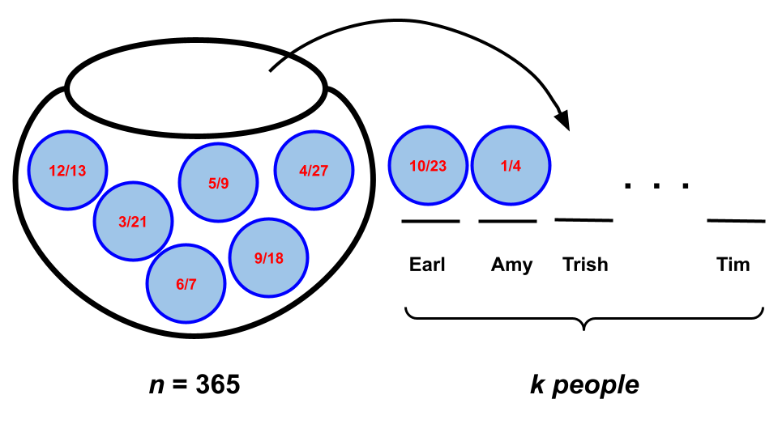
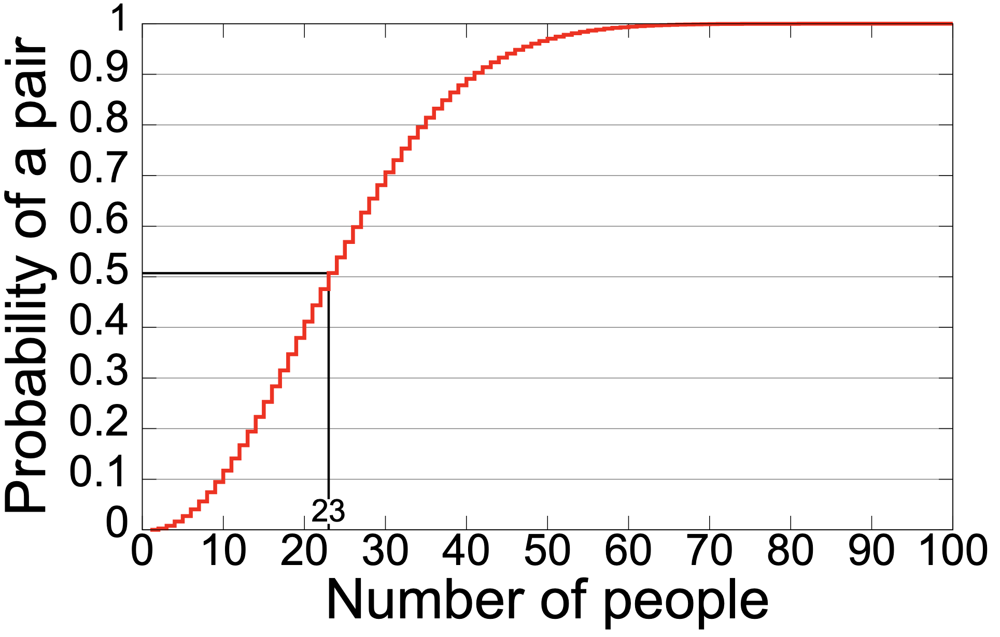
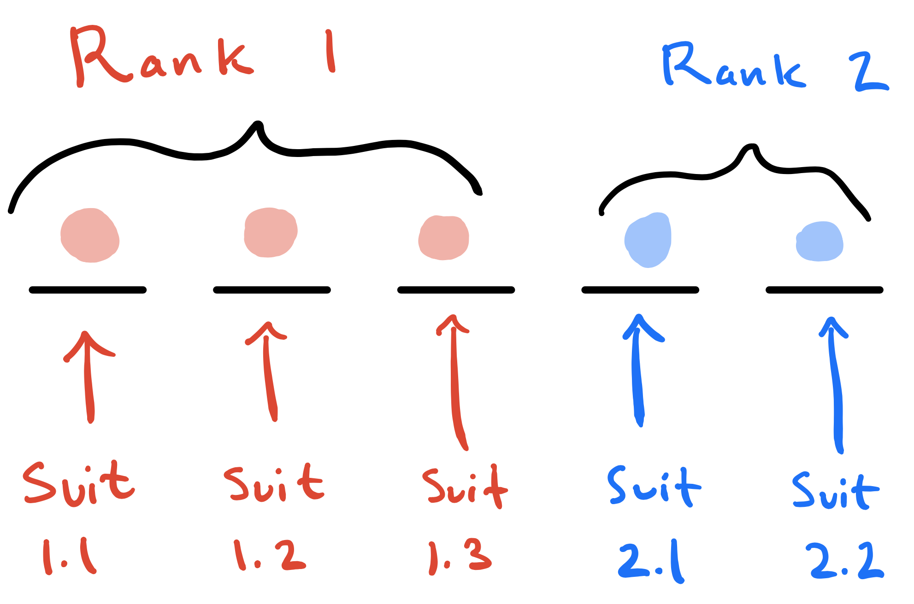

Alright. So you've seen this workflow where you use `for` loop + `sample` + `if() {...} else {...}` to simulate a random phenomenon, tally up how many times some event occurs, and then approximate the probability using the sample proportion. You practiced this on [Lab 1](/lab/lab-1.html), [Lab 2](/lab/lab-2.html), [Problem Set 1](/problems/pset-1.html#problem-9), and [Problem Set 2](/problems/pset-2.html#problem-8). I think you get the idea at this point, but don't sleep on this skill. Whipping up a quick simulation to verify that it agrees with a mathematical calculation is a standard part of the modern practitioner's toolkit.

Today, we'll give the simulation a brief rest and focus on further practice with *counting techniques* for computing exact probabilities in situations where the sample space is finite and all outcomes are equally-likely. Along the way, you will also practice using Quarto and LaTeX to write-up *full solutions* for each task.

## Advice for counting problems

As with writing proofs, there is no bullet-proof recipe or algorithm for solving a counting problem in probability, but here are some tips to get you on track:

1. (**do as little counting as possible**) Let's face it: counting, like integration, is a huge pain in the ass. So we don't want to do any more than we have to. Your first step should always be to simplify the problem as far as you possibly can using set theory and the probability rules: is this event the union of other events? are those events disjoint? might the complement be *easier* to work with? is there a *partition* that could help me? Only after you have exhausted all of those options should you count;
1. (**clarify what a single outcome consists of**) If I am studying the result of four coin flips, a single outcome is not H versus T. It's a string like HHTH or TTTH. Once you're clear on what an outcome consists of, decompose it into its distinct traits. In this example, each of the four flips is a trait. Once you've decomposed an outcome into traits, you can invoke the *counting principle*: count the traits separately and multiply. At a very high level, that's "all we are doing," but things can get elaborate;
1. (**clarify the role of order and replacement**) You will probably do this in tandem with the surrounding items, but until you've answered the questions "does order matter" and "am I replacing or not" for yourself, you have no clue what tool you need to use;
    - **Pro-tip**: "order" may not really mean "order." When we ask "does order matter or not," really what we are often asking is: "does it matter who gets what?" In other words, when we draw balls from the jar to fill our $k$ slots, are those slots *distinguishable* or not? Are they named? Are they labeled? Do they have distinct identities or *roles*? If so, then the order in which the balls are drawn corresponds to "who got what." If "who gets what" is relevant in your application (eg. if Ethel getting red and Seamus getting blue counts as a distinct outcome from Ethel getting blue and Seamus getting red), then order matters. The birthday problem below is a classic example of this;
1. (**count $S$ first**) In all of these counting problems, at some point you must apply $P(A)=\#(A)/\#(S)$. I typically recommend that you start at the bottom and work your way up. So figure out $\#(S)$, and then move on to $\#(A)$. $\#(S)$ will often be easier to compute, and the process of doing so will force you to clarify what you need to clarify from above, which will help with $\#(A)$ later.

## Task 1

Imagine that $k$ random people convene for a birthday party, and answer the following questions:

- What is the probability that at least 2 of the attendees share a birthday?
- How large does the party need to be for the above probability to be at least 50%?

You can make the following assumptions:

- There are 365 days in the year (so we ignore leap day);
- A random attendee is equally likely to have any of the 365 days as their birthday (this is
empirically false, but oh well);
- The party is not being held at a popular restaurant or a laser tag venue or any other such place
where you would expect many birthday guys and gals to descend at the same time. Imagine it is one of those field soirées you people are so fond of. It's just $k$ random people frolicking around the maypole on some blasted heath;
- The attendees are independent. If two folks have the same birthday, it is pure coincidence.

::: {.callout-warning collapse="true"}
## Solution

{#fig-birthday-draw fig-align="center" width="60%"}

Taking my own advice, let's count the sample space first, which will force us clarify exactly what an "outcome" consists of, and force us to think about order and replacement.

What is the sample space $S$, anyway? It is the set of all possible assignments of birthdays to $k$ people. @fig-birthday-draw visualizes what we have in mind. We have $k$ people (slots) at this party, and their birthdays have been randomly assigned to them as if we were drawing them from the proverbial urn; each ball is one of the possible days of the year. So to compute $\#(S)$, we are selecting $k$ from $n=365$. But how? 

- This is **with replacement** because two people could have been born on the same day. Indeed, if we ruled this possibility out, there would be nothing for us to study. So when a birthday comes out, it goes back in the jar to potentially be drawn again;
- **Order matters**. In @fig-birthday-draw we have labeled the slots with the names of the unique attendees. This makes each slot distinct, and the order in which the balls (dates) are drawn determines which person receives which date. We consider Trish on 9/3 and Tim on 4/30 a different outcome from Trish on 4/30 and Tim on 9/3, and so order matters here.

With that, we know that $\#(S)=365^k$. So what is $\#(A)$? Start by registering that "*at least* 2" is spooky language. There are several (too many) ways that "at least two" people could share a birthday. The complementary event $A^c$ is "no one shares a birthday," which seems simpler, so to get this over the line, we will use the complement rule:
  
$$
P(A)=1-P(A^c)=1-\frac{\#(A^c)}{\#(S)}=1-\frac{\#(A^c)}{365^k}.
$$
So, what is $\#(A^c)$? How many ways can we assign birthdays to $k$ people such that *no one* shares? Well, order continues to matter, but now we are drawing *without* replacement. Once a birthday is assigned, it will not be assigned again, thus ensuring that there are no duplicates. As such, $\#(A^c)=365!/(365-k)!$, and so 

$$
P(A)=1-P(A^c)=1-\frac{365!}{365^k(365-k)!}.
$$

Done. Except this formula is not super illuminating on its face, so let's plug in values of $k$ and see what these numbers are. Because the counts in the numerator or the denominator are so huge, you'll get numerical problems if you naively try to use R as a calculator:

```{r}
k <- 3
1 - factorial(365) / (factorial(365 - k) * 365 ^ k)
```

But this example is so famous that R provides a canned function for intelligently computing these probabilities:

```{r}
pbirthday(3)
pbirthday(7)
```

Here's what you get if you graph or list out a bunch of these probabilities for various values of $k$, the number of partygoers:

:::: columns

::: {.column width="48%"}
| $k$  | $P(A)$  | $\binom{k}{2}$ |
| --- | --- | --- | 
|1 | 0.0 | 0 |
|2 | 0.0027 | 1 |
|5 | 0.027 | 10 |
|10 | 0.116 | 45 |
|15 | 0.2529 | 105 |
|23 | 0.5072 | 253 |
|32 | 0.753 | 496 |
|56 | 0.988 | 1540 |
|60 | 0.994 | 1770 |
|100 | 0.9999 | 4950 |
|$\vdots$ | $\vdots$ | $\vdots$ |
|366 | 1.0 | 66795 | 
:::

::: {.column width="48%"}

:::

When $k=1$, then $P(A)=0$ because that one person has nobody to match with. By the time $k=366$ attend, at least one match is guaranteed as a consequence of the *pigeonhole principle*. Imagine 365 people are in attendance, and by some miracle there has not already been a birthday match; every person has a unique birthday. As soon as a 366th person arrives at the party, their birthday *must* match with someone. Every day of the year is already represented in the room.
    
So those are the extreme cases of $k=1$ and $k=366$. But newcomers tend to be surprised by what happens in between. It only takes $k=23$ for a 50% chance of at least one match, and by the time $k=60$, it's all but guaranteed. [Folks often guess](/slides/2026-08-24-welcome.html#/your-guesses-1) that you need a large number of attendees (on the order of hundreds) for the probability of a match to be high, but what they fail to realize is that every unique pair of people is a fresh opportunity for a match. The table shows the number of unique pairs for each $k$, and while $k$ may be small, the number of pairs gets large pretty quickly, making at least one match more and more likely.

::::


:::

## Task 2

If a five-card hand is randomly dealt to you from a standard deck of 52 playing cards, what is the probability that you are dealt a *full house*: 3 cards of one rank and 2 cards of another rank?

::: {.callout-warning collapse="true"}
## Solution

{#fig-full-house fig-align="center" width="50%"}

In words, our sample space and our event are $S$ = "the set of all possible five-card hands" and $A$ = "your hand is a full house." We have a deck with only 52 cards, and assuming it is adequately shuffled, no card is favored over any other, so we have a finite sample space with equally-likely outcomes. Therefore, we will ultimately apply $P(A) = \#(A)/\#(S).$ To compute $\#(S)$, we have to count all of the ways that five cards could be selected from a deck of 52. So we are "selecting $k = 5$ from $n = 52$." But does order matter, and are we drawing with replacement?

- We are sampling **without replacement**. Once a card is dealt to you, it stays in your hand, it does not go back in the deck to potentially be drawn again;
- **Order does not matter**. The only thing distinguishing one hand from another hand is the raw contents. The order in which the cards were dealt to you is irrelevant.

So, we are selecting $k = 5$ from $n = 52$ without replacement when order does not matter. This means that $\#(S)=\binom{52}{5}$. Great! Now what about $\#(A)$? To specify a full house, we need to determine four traits:

- Rank 1 for three of the cards;
- Rank 2 for two of the cards;
- The suits of the Rank 1 cards;
- The suits of the Rank 2 cards.

This is pictured in @fig-full-house. By the counting principle, we just have to multiply together the number of options for each trait, i.e. the total number of choices for Rank 1, Rank 2, the suits for the Rank 1 cards, and the suits for the Rank 2 cards. So:

- There are 13 ways to choose Rank 1;
- Rank 2 must be distinct from Rank 1, so once Rank 1 is determined, there are 12 ways to choose Rank 2;
- Among the Rank 1 cards, we are drawing without replacement and order is irrelevant, so there are $\binom{4}{3}=4$  ways to choose the three suits;
- Among the Rank 2 cards, we are drawing without replacement and order is irrelevant, so there are  $\binom{4}{2}=6$ ways to choose the two suits.

Given this, the counting principle tells us that the total number of ways to specify a full house is

$$
\#(A) = 13\cdot 12\cdot 4\cdot 6=3744.
$$

So the probability of interest is:

$$
P(A) = \frac{\#(A)}{\#(S)}=\frac{3744}{\binom{52}{5}}\approx 0.00144.
$$

:::

## Task 3

Now suppose a four-card hand is randomly dealt to you from a standard deck of 52 playing cards, and we define "full house" to mean that 2 cards are of one rank and 2 cards are of the other rank. What is the probability of a full house in this case?

::: {.callout-warning collapse="true"}
## Solution

This is very similar to the previous problem, but with one wrinkle that hopefully illuminates the role that "order" can play in this business.

Analogously to the previous problem, the denominator is $\#(S)={52\choose4}$, but the logic for $\#(A)$ changes. This is because Rank 1 and Rank 2 are *not distinguishable traits*. Before, we could indeed distinguish the two: Rank 1 is the one with 3 cards, and Rank 2 is the one with 2 cards. But now we have 2 cards for each of the ranks. So instead of $\#$(Rank 1) $\times$ $\#$(Rank 2), we count the number of pairs of two ranks. Thus we get

$$
\#(A) = {13\choose 2}\cdot {4\choose 2}\cdot {4\choose 2}=2808,
$$ 

and *not* $13\cdot 12\cdot{4\choose 2}\cdot {4\choose 2}$. The $13\cdot 12$ from before *acknowledged* order, because from 13 possible ranks we are selecting 2, and the order corresponds to which group of cards gets which rank: does the trio get the Jack and the pair get the 10, or vice versa. Those count as different outcomes. The ${13\choose 2}$ now *ignores* order, because from 13 possible ranks we are selecting 2, but the two groups are now indistinguishable. One pair getting a Jack and the other pair getting a 10 is the same outcome as if you reversed it.

Finally, the probability of interest is:

$$
P(A) = \frac{\#(A)}{\#(S)}=\frac{2808}{\binom{52}{4}}\approx 0.01037.
$$


:::
