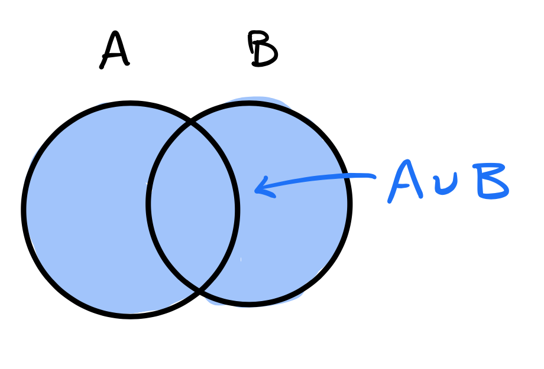
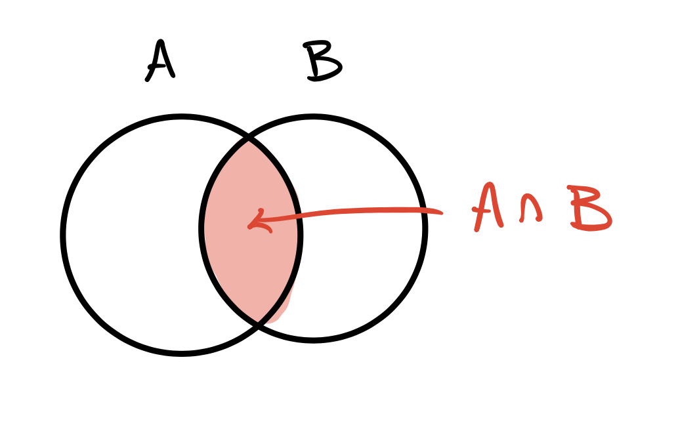
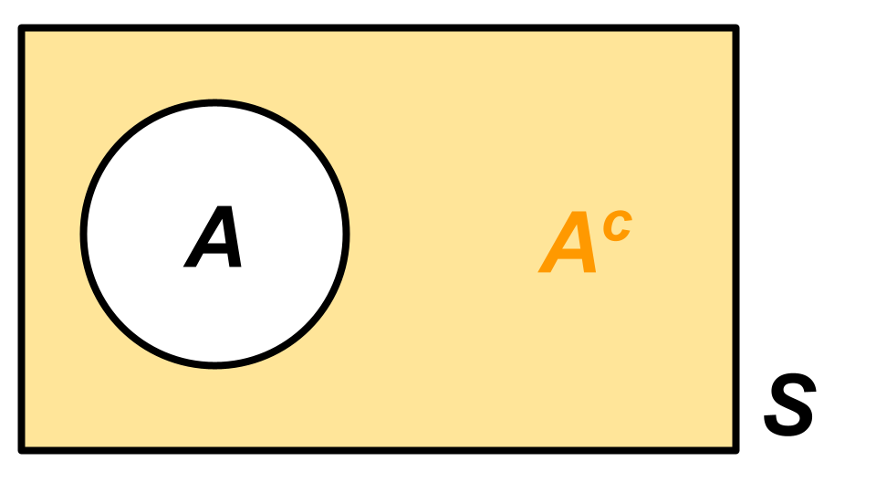
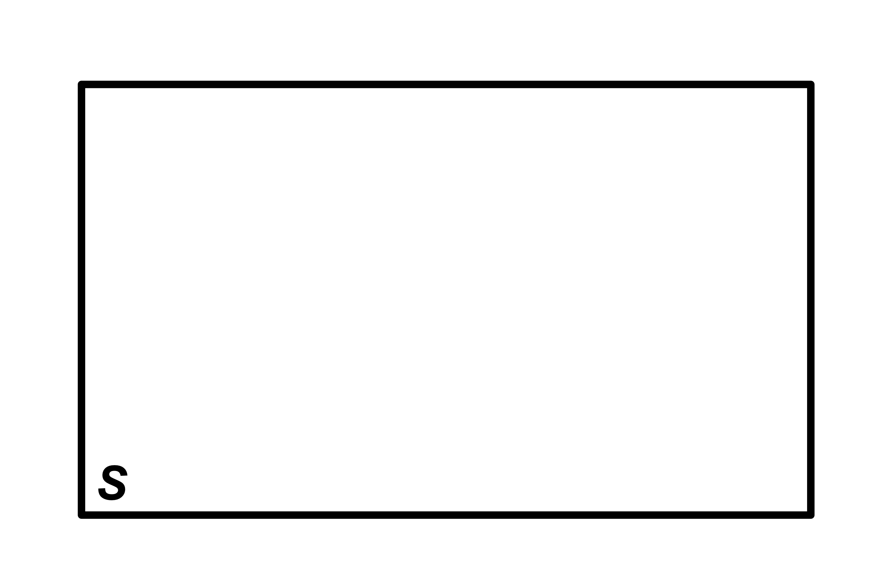
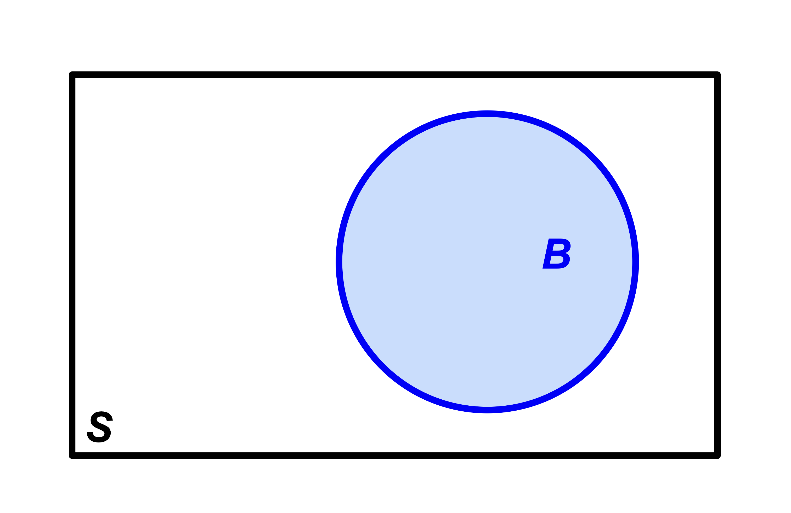
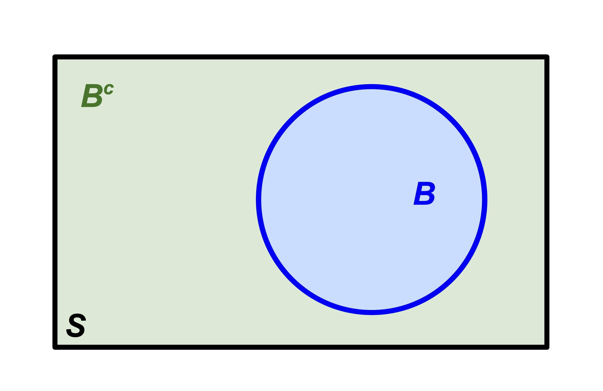
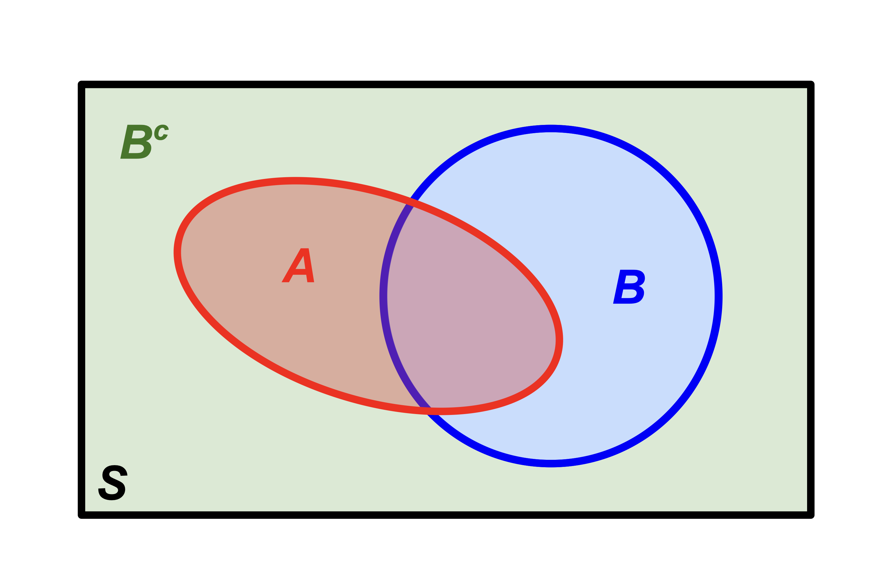
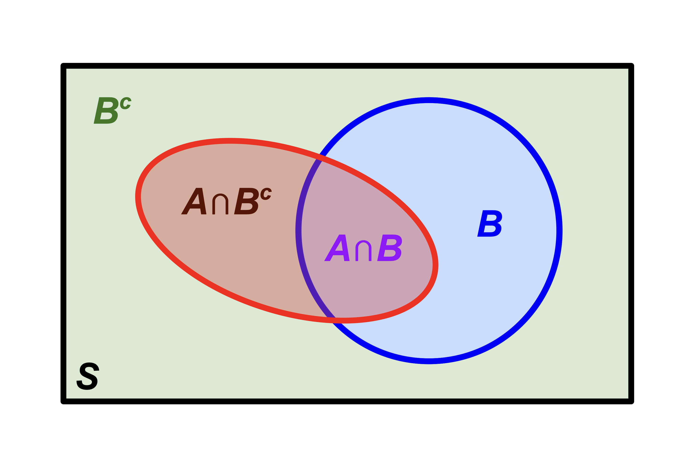

# Let's talk about our (calculus) needs

## What we need {.scrollable}

- First and foremost, integration. *Especially* [improper integration](/math/integration.html#improper-integration-we-will-do-this-a-lot). Stuff like this will become our daily bread:

$$
\begin{aligned}
\int_0^\infty F'(x)\,\text{d}x
&=
\lim_{b\to\infty}\int_{0}^bF'(x)\,\text{d}x
\\
&=\lim_{b\to\infty}[F(x)]_0^b\\
&=\lim_{b\to\infty}F(b) - F(0);
\end{aligned}
$$

- In order to *anti*differentiate, you need to be able to *differentiate*, and in order to evaluate an *improper* integral, you need to be able to take limits. Hence, all of Calc I and II is on the table for us;

- Our use of infinite series will be relatively modest. You will mainly have to *recognize* the famous ones (eg. geometric series, Taylor series of $e^x$, etc). However, sometimes these otherwise friendly faces will be very cleverly disguised (you've already seen that [here](/problems/pset-0.html#problem-6)), and so "recognition on steroids" is a new skill you must cultivate. JZ calls it "massage and squint," but more on that later.

## What we *won't* need

It's not that these things are irrelevant in probability, but I already know they will not appear on any of the assignments, so let's not waste our [precious divine energy](https://youtu.be/sXrq2j5OudU?si=EY1lGqItByOEvoUO) reviewing:

::: incremental
- volumes of revolution (eg. washer method, etc);
- related rates;
- implicit differentiation;
- the method of partial fractions;
- convergence tests for series;
- trig identities and derivatives (only an *itty* bit).
:::

## The math helpers

The inclusions and omissions were deliberate on my part:

- [log and exponent properties](/math/logexp.html);
- [derivatives](/math/differentiation.html);
- [integrals](/math/integration.html);
- [limits and continuity](/math/limits.html);
- [sequences and series](/math/series.html).

If it's not mentioned there, you probably don't need it this semester.

## Calc III?

::: incremental
- Not a prerequisite for this class, but it is a prerequisite for STA 332 (the next class in the theory sequence);
- In STA 240, we typically stick to one or two random quantities at a time. Univariate calculus is enough;
- If you want to study large collections of interrelated random quantities, you need Calc III and Linear Algebra;
- If you go all the way and break into [*high-dimensional* probability](https://webapps.math.uci.edu/~rvershyn/papers/HDP-book/HDP-book.html), things get fun and funky and totally gorgeous. And more mathematical!
:::

# Last time

## Set operations

| Set | Picture | Logic |
|---------------|-----------------|---------------|
| $A\cup B$             | {width="60%"} | (inclusive) OR |
| $A\cap B$             | {width="70%"} | AND |
| $A^c$                 | {width="60%"} | NOT |

## Algebraic properties {.medium}

$$
\begin{matrix}
    \text{Commutative} & A\cup B=B\cup A\\
    & A\cap B=B\cap A\\
    &\\
    \text{Associative} & (A\cup B)\cup C = A\cup (B\cup C)\\
    & (A\cap B)\cap C = A\cap (B\cap C)\\
    &\\
    \text{Distributive} & (A\cup B)\cap C = (A\cap C)\cup (B\cap C)\\
    &(A\cap B)\cup C = (A\cup C)\cap (B\cup C)\\
    &\\
    \text{De Morgan's Laws} & (A\cup B)^c=A^c\cap B^c\\ 
    & (A\cap B)^c=A^c\cup B^c.
\end{matrix}
$$

## A theorem we will use often

If $A,\,B\subseteq S$, then 

- $A = (A\cap B)\cup (A\cap B^c)$;
- $(A\cap B)\cap (A\cap B^c)=\varnothing$.

In words

> A set can always be *decomposed* into the union of disjoint pieces by intersecting the set with the members of a *partition*. 

## Start with the sample space

{fig-align="center"}

## Introduce $B$

{fig-align="center"}

## Introduce $B^c$

{fig-align="center"}

## $B$ and $B^c$ form a *partition* of $S$

$B$ and $B^c$ together form the simplest example of a **partition** of $S$:

- They cover everything: $B\cup B^c=S$;
- They don't overlap: $B\cap B^c=\varnothing$.

## Introduce $A$

{fig-align="center"}

## Notice the decomposition

{fig-align="center"}

# Probability time

## Random phenomena {.scrollable}

In this course, we are studying **random phenomena**: things whose outcome cannot be known with certainty. Examples of random phenomenon include:

::: incremental
- the outcome of a coin flip;
- the outcome of a die roll;
- the Poker hand dealt to you from a shuffled deck;
- the outcome of a presidential election;
- whether or not a basketball player makes a free throw shot;
- whether or not my soufflé falls in the oven;
- whether or not the opera singer hits the high note;
- the next song in your Spotify shuffle;
- the next word generated by ChatGPT;
- the birth weight of a newborn child;
- the number of costumers that will arrive at a store or restaurant on a given day;
- when and where a hurricane will make landfall;
- the time until an unstable particle will decay;
- the number of claims an insurance company receives in a month;
- the bid-ask spread of Google stock at 2:37 pm ET next Wednesday.
:::

These are all things that, for one reason or another (physical reality, lack of information, imperfect measurement), we do not believe we can perfectly predict. 

::: callout-warning
## Philosophy alert!
This is a course on the mathematics of probability, not the philosophy. As such, we will not quibble about what it means for a phenomenon to *truly* be random. We will simply take the pragmatic view that there exist phenomena that human beings find sufficiently surprising and unpredictable that it pays to model them *as if* they are random. 
:::

## Our main object of study

::: callout-note
## Definition: probability space

A **probability space** is a triple $(S,\, A\subseteq S,\, P)$:

- (**sample space**) A nonempty set  $S$ containing all of the possible outcomes of the phenomenon;
- (**events**) Subsets $A\subseteq S$ of the sample space -- sets of possible outcomes;
- (**probability measure**) A function $P$ that takes an event $A$ and assigns to it a real number called $P(A)$. This number is the probability that the ultimate outcome of the random phenomenon is an element of the subset $A$.

:::

## The simplest example

Imagine we are studying the outcome of a fair coin flip. Then:

- **sample space**: $S=\{H,\,T\}$;
- **events**: $\varnothing$, $\{H\}$, $\{T\}$, $S$;
- **probability measure**: 

$$
\begin{aligned}
P(\varnothing)&=0 && \text{(chance nothing happens)}\\
P(\{H\})&=1 / 2\\
P(\{T\})&=1 / 2\\
P(S)&=1.&& \text{(chance something happens)}\\
\end{aligned}
$$

## That word "space" {.scrollable}

In mathematics, a **space** is a set together with some extra structure. Once you define the structure, you can spend a whole career proving theorems about the downstream consequences of that definition.

- most of your mathematical career has focused on **Euclidean space**: the sets $\mathbb{R}$, $\mathbb{R}^2$, $\mathbb{R}^3$, etc together with the familiar geometry of lengths, distances, and angles;
- If you've taken linear algebra, you saw **vector spaces**: a set together with addition and scalar multiplication.

If you keep going, you'll see rings, fields, *measure spaces*, topological spaces, metric spaces, normed spaces, Banach spaces, inner product spaces, Hilbert spaces, function spaces, and many more.

## Sample spaces

The set of possible outcomes of a random phenomenon:

<table>
  <thead>
    <tr>
      <th>Phenomenon</th>
      <th>Sample space $S$</th>
    </tr>
  </thead>
  <tbody>
    <tr class="fragment">
      <td>Flip two coins in order</td>
      <td>$\{HH,\:HT,\:TT,\:TH\}$</td>
    </tr>
    <tr class="fragment">
      <td>Roll a single die</td>
      <td>$\{1,\:2,\:3,\:4,\:5,\:6\}$</td>
    </tr>
    <tr class="fragment">
      <td>Card dealt from a shuffled deck</td>
      <td>$\{2\clubsuit,\,3\clubsuit,\,4\clubsuit,\,\ldots\}$</td>
    </tr>
    <tr class="fragment">
      <td>Winning party in US election</td>
      <td>$\{\text{R}, \text{D}, \text{L}, \text{G}, ..., \text{DSA}\}$</td>
    </tr>
    <tr class="fragment">
      <td>Your blood sodium level in mEq/L</td>
      <td>$\mathbb{R}_+=(0,\infty)$</td>
    </tr>
    <tr class="fragment">
      <td># of insurance claims in a week?</td>
      <td>$\mathbb{N}$</td>
    </tr>
    <tr class="fragment">
      <td>Return on a risky asset</td>
      <td>$\mathbb{R}$</td>
    </tr>
  </tbody>
</table>

## Events {.scrollable}

An event is a set of possible outcomes -- a subset of the sample space. We assign probabilities to events. You may have thought that we would be assigning probabilities to individual outcomes, and we are doing that too. You can have an event $A = \{s\}$ containing a single outcome. But we are going further than that.

When talking informally about a "random event," we usually describe it in words. But this qualitative description can always be written as a subset of the sample space:

<table>
  <thead>
    <tr>
      <th>Description</th>
      <th>Event $A$</th>
    </tr>
  </thead>
  <tbody>
    <tr class="fragment">
      <td>“the first of two coin flips is a head”</td>
      <td>$\{HH,\:HT\}$</td>
    </tr>
    <tr class="fragment">
      <td>“the die is even”</td>
      <td>$\{2,\:4,\:6\}$</td>
    </tr>
    <tr class="fragment">
      <td>“dealt a four”</td>
      <td>$\{4\clubsuit,\,4\heartsuit,\,4\spadesuit,\,4\diamondsuit\}$</td>
    </tr>
    <tr class="fragment">
      <td>“right-wing party wins”</td>
      <td>$\{\text{R},\,\text{L},\,...\}$</td>
    </tr>
    <tr class="fragment">
      <td>“blood sodium in healthy range”</td>
      <td>$[133,\:145]$</td>
    </tr>
    <tr class="fragment">
      <td>“over a thousand claims”</td>
      <td>$\{1001,\,1002,\,1003,\,\ldots\}$</td>
    </tr>
    <tr class="fragment">
      <td>“your investment loses money”</td>
      <td>$(-\infty,\:0)$</td>
    </tr>
  </tbody>
</table>

Useful skill: translating the verbal description into the actual set.

# Translating set theory into probability

## Running example: where will the meteor land? {.scrollable}

The sample space is the set of all (long, lat) coordinates in this spatial region:

{fig-align="center" width="80%"}

## Example events

| Symbol | Description                                   |
|--------|-----------------------------------------------|
| $A$    | “Meteor lands in the United States”           |
| $B$    | “Meteor lands in Canada”                      |
| $C$    | “Meteor lands in Mexico”                      |
| $D$    | “Meteor lands in adjacent waters” |
| $E$    | “Meteor lands in the Rocky Mountains”         |

## "OR" events (union) 

| Symbol | Description                                   |
|--------|-----------------------------------------------|
| $A$    | “Meteor lands in the United States”           |
| $B$    | “Meteor lands in Canada”                      |
| $C$    | “Meteor lands in Mexico”                      |
| $D$    | “Meteor lands in adjacent waters” |
| $E$    | “Meteor lands in the Rocky Mountains”         |

- “Meteor lands in the US **or** Canada”  
  → $A \cup B$

- “Meteor lands in Mexico **or** adjacent waters”  
  → $C \cup D$

- “Meteor lands in the Rocky Mountains **or** Canada”  
  → $E \cup B$
  
- “Meteor lands in North America”  
  → $A\cup B\cup C$

## "AND" events (intersection) 

| Symbol | Description                                   |
|--------|-----------------------------------------------|
| $A$    | “Meteor lands in the United States”           |
| $B$    | “Meteor lands in Canada”                      |
| $C$    | “Meteor lands in Mexico”                      |
| $D$    | “Meteor lands in adjacent waters” |
| $E$    | “Meteor lands in the Rocky Mountains”         |

- “Meteor lands in the Rocky Mountains **and** the US”  
  → $E \cap A$

- “Meteor lands in the US **and** Mexico”  
  → $A \cap C = \varnothing$

- “Meteor lands in North America **and** adjacent waters”  
  → $(A \cup B \cup C) \cap D = \varnothing$

## "NOT" events (complement) 

| Symbol | Description                                   |
|--------|-----------------------------------------------|
| $A$    | “Meteor lands in the United States”           |
| $B$    | “Meteor lands in Canada”                      |
| $C$    | “Meteor lands in Mexico”                      |
| $D$    | “Meteor lands in adjacent waters” |
| $E$    | “Meteor lands in the Rocky Mountains”         |

- “Meteor does **not** land in the US”  
  → $A^c$

- “Meteor does **not** land in the Rocky Mountains”  
  → $E^c$

- “Meteor does **not** land on land at all”  
  → $(A \cup B \cup C)^c = D$

## Implication 

| Symbol | Description                                   |
|--------|-----------------------------------------------|
| $G$    | “Meteor lands in Georgia”           |
| $S$    | “Meteor lands in The South”        |
| $U$    | “Meteor lands in the United States”   |
| $N$    | “Meteor lands in North America” |

Notice:

$$
G\subseteq S\subseteq U\subseteq N.
$$

::: incremental
- If we learn that the meteor landed in The South, that implies that it landed in the USA, which implies that it landed in North America;
- It may or may not have landed in Georgia.
:::

## Summary

| **Probability**                | **Set theory**        |
|--------------------------------|-----------------------|
| $A$ or $B$ occur               | $A\cup B$             |
| $A$ and $B$ occur              | $A\cap B$             |
| $A$ does not occur             | $A^c$, with $S$ as the reference                 |
| $A$ occuring implies $B$ also occurs               | $A\subseteq B$        |
| $A$ and $B$ mutually exclusive | $A\cap B=\varnothing$ |
