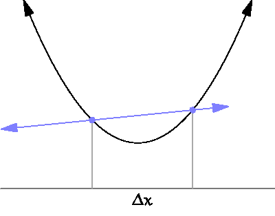

The **derivative** of a function $f(x)$ is its instantaneous rate of change. On a graph, this corresponds to the slope of the tangent line. We will denote derivatives by $f'(x)$ or $\text{d}f/\text{d}x$ or something like that. 

When it exists, **which it doesn't always**, the derivative is defined as the limit of difference quotients:

$$
f'(x)=\lim_{\Delta x\to0}\frac{f(x+\Delta x)-f(x)}{\Delta x}.
$$

So, "rise over run" as the "run" bit gets arbitrarily small.

{fig-align="center"}

As such, the derivative is the continuous analog to a discrete difference.

## Derivative rules 


| rule | function       | derivative |
|------|--------------------|--------------|
| constant    | $h(x)=c$ | $h'(x)=0$        |
| scaling     | $h(x)=c\cdot f(x)$ |  $h'(x)=c\cdot f'(x)$ |
| sum/difference | $h(x)=f(x)\pm g(x)$ | $h'(x)=f'(x)\pm g'(x)$ |
| linearity | $h(x)=a\cdot f(x)\pm b\cdot g(x)$ | $h'(x)=a\cdot f'(x)\pm b\cdot g'(x)$ |
| power | $h(x)=x^n$| $h'(x)=nx^{n-1}$|
| product |$h(x)=f(x)g(x)$| $h'(x)=f'(x)g(x)+f(x)g'(x)$|
| quotient |$h(x)=f(x)/g(x)$| $h'(x)=\frac{f'(x)g(x)-f(x)g'(x)}{g(x)^2}$|
| chain |$h(x)=f(g(x))$| $h'(x)=f'(g(x))g'(x)$|
| exponential |$h(x)=e^x$| $h'(x)=e^x$|
| natural log | $h(x)=\ln(x)$| $h'(x)=1/x$|


## Curvature

If you take the derivative of $f$, you get the **first derivative** $f'$. If you take the derivative of the derivative, you get the **second derivative** $f''$. The derivative of the derivative of the derivative is the **third derivative** $f'''$, and [on and on](https://youtu.be/TW28iWV7nxE?si=EZrdZrENMdE6JvT1). But let's focus on the first two. The derivatives contain information about the shape of the original function:

- the first derivative tells you if the function is increasing or decreasing;
    - if $f'(x)>0$, then $f$ is increasing at $x$;
    - if $f'(x)<0$, then $f$ is decreasing at $x$;
    - if $f'(x)=0$, then $f$ is not changing at $x$;
- if the second derivative tells you about the **curvature** (aka **concavity**) of the function:
    - if $f''(x)>0$, then $f$ is **concave up** ($\cup$, smiling) at $x$;
    - if $f''(x)<0$, then $f$ is **concave down** ($\cap$, frowning) at $x$.
    
Here is an illustration with the function $f(x)=x^3-x$ and its derivatives $f'(x)=3x^2-1$ and $f''(x)=6x$ (power rule!):

```{r}
#| label: fig-derivatives
#| echo: false
#| fig-align: center
#| fig-asp: 1

up_color = "orange"
down_color = "blue"
ticks = seq(-1.5, 1.5, by = 0.5)
labs = c(NA, ticks[-c(1, length(ticks))], NA)
par(mfrow = c(3, 1), mar = c(0, 5, 0, 0.5))
curve(x^3 - x, from = -2, to = 2, 
      xaxt = "n", xaxs = "i", col = "red", 
      yaxt = "n", yaxs = "i",
      lwd = 2, xlim = c(-1.5, 1.5), ylim = c(-1, 1),
      ylab = "original function", 
      panel.first = c(polygon(x = c(-10, 0, 0, -10),
                            y = c(-100, -100, 100, 100),
                            col = rgb(0, 0, 1, 0.1),
                            border = NA),
                      polygon(x = c(10, 0, 0, 10),
                            y = c(-100, -100, 100, 100),
                            col = rgb(1, 0.5, 0, 0.1),
                            border = NA))
      )
legend("topleft", "concave down", text.col = down_color, 
       bty = "n", bg = "transparent", cex = 1.5)
legend("bottomright", "concave up", text.col = up_color, 
       bty = "n", bg = "transparent", cex = 1.5)
box(lwd = 3)
abline(v = c(0, -1/sqrt(3), 1/sqrt(3)), lty = c(1, 2, 2))
axis(1, pos = 0, at = ticks, labels = labs)
curve(3*x^2 - 1, from = -2, to = 2, 
      xaxt = "n", xaxs = "i", col = "red", 
      yaxt = "n", yaxs = "i",
      lwd = 2, , xlim = c(-1.5, 1.5), ylim = c(-2, 4),
      ylab  = "first derivative")
segments(-1/sqrt(3), 0, -1/sqrt(3), 100, lty = 2)
segments(1/sqrt(3), 0, 1/sqrt(3), 100, lty = 2)
axis(1, pos = 0, at = ticks, labels = labs)
points(c(-1/sqrt(3), 1/sqrt(3)), c(0, 0), pch = 19, cex = 2, col = "red")
box(lwd = 3)
abline(v = 0)
curve(6*x, from = -2, to = 2, 
      xaxt = "n", xaxs = "i", col = "red", 
      yaxt = "n", yaxs = "i",
      lwd = 2, , xlim = c(-1.5, 1.5),
      ylab = "second derivative",
            panel.first = c(polygon(x = c(-10, 0, 0, -10),
                            y = c(-100, -100, 100, 100),
                            col = rgb(0, 0, 1, 0.1),
                            border = NA),
                      polygon(x = c(10, 0, 0, 10),
                            y = c(-100, -100, 100, 100),
                            col = rgb(1, 0.5, 0, 0.1),
                            border = NA)))
box(lwd = 3)
abline(v = 0)
axis(1, pos = 0, at = ticks, labels = labs)
points(0, 0, pch = 19, col = "red", cex = 2)
```

When the first derivative changes sign (at $x^\star=\pm1/\sqrt{3}$), that corresponds to the original function switching from increasing to decreasing, or vice versa. When the second derivative changes sign (at $x_0=0$), that corresponds to the original function switching from concave down (frowning) to concave up (smiling). A point like $x=0$ in this example where the concavity changes is called an **inflection point**. If $x_0$ is an inflection point, then that means it's also a root of the second derivative: $f''(x_0)=0$. In order for the second derivative to change sign, it has to cross the $x$-axis. 

However, just because the second derivative is zero doesn't mean there was inflection. Consider $f(x)=x^4$ and its derivatives $f'(x)=4x^3$ and $f''(x)=12x^2$:

```{r}
#| label: fig-derivatives-2
#| echo: false
#| fig-align: center
#| fig-asp: 0.5
par(mfrow = c(1, 3), mar = c(1, 1, 5, 1))
curve(x^4, from = -1, to = 1, n = 1000,
      xaxt = "n", xaxs = "i", 
      yaxt = "n", yaxs = "i",
      col = "red", lwd = 2, ylim = c(-2, 2),
      main = "Original function", bty = "n")
axis(1, pos = 0)
axis(2, pos = 0)
curve(4*x^3, from = -1, to = 1, n = 1000,
      xaxt = "n", xaxs = "i", 
      yaxt = "n", yaxs = "i",
      col = "red", lwd = 2, ylim = c(-2, 2),
      main = "First derivative", bty = "n")
axis(1, pos = 0)
axis(2, pos = 0)
curve(12*x^2, from = -1, to = 1, n = 1000,
      xaxt = "n", xaxs = "i", 
      yaxt = "n", yaxs = "i",
      col = "red", lwd = 2, ylim = c(-2, 2),
      main = "Second derivative", bty = "n")
axis(1, pos = 0)
axis(2, pos = 0)
```

In this case, we see that while the second derivative has a root at zero, it doesn't actually cross the $x$-axis. It's just swooping down and giving it a gentle lil' smooch from above. Correspondingly, we see that the original function never changes concavity. Therefore, we say that $f''=0$ is a **necessary but not sufficient** condition for the original $f$ to change concavity. To verify, you must actually check that the second derivative has different sign before and after the root. Bummer!

## Optimization

Differentiation is useful when we seek to *optimize* a function. That is, find where it has local maxima or minima. For purposes of illustration, I'll focus on maxima. Formally, given an **objective function** $f$, we seek to find the $x$-values at which $f$ has a maximum:

$$
\underset{x\in\mathbb{R}}{\arg\max}\,f(x).
$$

Notice that I did not write $\max f(x)$. In this class, it turns out that we will seldom care about the actual largest value that the function obtains. Instead, we care only for *where* that value occurs. So we are interested in the maxi*mizer*; the *location* of the maximum; the $x$-value *that does* the maximizing. Hence, argmax and not max. Here's an illustration:

```{r}
#| echo: false
#| fig-align: center
#| fig-width: 4
#| fig-asp: 0.75
par(mar = c(2, 6, 2, 0))
curve(-(x-3)^2 + 5, from = 0, to = 6, ylim = c(-4, 6),
      xaxt = "n", yaxt = "n", bty = "n", ylab = "",
      col = "red", lwd = 3,
      panel.first = c(segments(3, -4, 3, 5, lty = 2, col = "pink", lwd = 2),
                      segments(0, 5, 3, 5, lty = 2, col = "pink", lwd = 2)),
      main = expression("f(x) ="~-x^2~" + 6x - 4"))
axis(1, pos = 0)
axis(2, pos = 0)
mtext("max f(x)", side = 2, at = 5, las = 1, line = 1, col = "blue")
mtext("argmax f(x)", side = 1, at = 3, col = "blue")
```

Inspecting this picture, we notice that the maximum corresponds to a point where the derivative (slope of the tangent line) is zero. In order for the function to "top out," it must at some point have switched from being increasing (positive derivative) to decreasing (negative derivative). When we ask where the maximum occurs, that's the same as asking where the first derivative switched sign (ie crossed the $x$-axis). So to optimize $f$, perhaps we can compute its first derivative, set it equal to 0, and solve:

$$
\begin{aligned}
f'(x)
=
-2x+6&=0
\quad
\implies
\quad
x^\star=3.
\end{aligned}
$$

A point like $x^\star$ in this example is called a **critical point**. A critical point *may* be the location of a maximum, but you have to check. If you recall the example in @fig-derivatives, there are two critical points $x^\star = \pm 1/\sqrt{3}$, but they correspond to different things: one is a minimum and one is a maximum. In order to classify the critical points as maximizers or minimizers (or neither!), you can perform the **second derivative test**: 

- if $f'(x^\star)=0$ and $f''(x^\star)<0$, then $x^\star$ is a maximizer;
- if $f'(x^\star)=0$ and $f''(x^\star)>0$, then $x^\star$ is a minimizer;
- if $f'(x^\star)=0$ and $f''(x^\star)=0$, then the test is inconclusive.

In the simple example above, the second derivative is always negative: $f''(x)=-2<0$. So $x^\star=3$ is indeed a maximizer.

::: callout-tip 
## Example: all possibilities in one

Consider this function:

$$
f(x)=x^3 e^{-x^2}.
$$

Applying the product, power, chain, and exponential rules (plus some algebra) gives you the first and second derivatives:

$$
\begin{aligned}
f'(x)
&=
x^3(-2x)e^{-x^2}
+
3x^2e^{-x^2}
\\
&=
e^{-x^2}(3x^2-2x^4)
\\
&=
x^2e^{-x^2}(3-2x^2)
\\
&\\
f''(x)
&=
e^{-x^2}(6x-8x^3)+(3x^2-2x^4)(-2x)e^{-x^2}
\\
&=
e^{-x^2}(6x-8x^3)+(4x^5-6x^3)e^{-x^2}
\\
&=
2xe^{-x^2}(3-4x^2+2x^4-3x^2)
\\
&=
2xe^{-x^2}(3-7x^2+2x^4)
,
\end{aligned}
$$

Pics or it didn't happen:

```{r}
#| label: fig-saddle
#| echo: false
#| fig-align: center
#| fig-asp: 1
#| fig-cap: The function $f$ has three critical points at $-\sqrt{3/2}$, 0, and $\sqrt{3/2}$ corresponding to a minimum, a saddle point, and a maximum.

ticks = seq(-3, 3, by = 0.5)
labs = c(NA, ticks[-c(1, length(ticks))], NA)
par(mfrow = c(3, 1), mar = c(0, 5, 0, 0.5))
curve(x^3 * exp(-x^2), from = -3, to = 3, n = 1000,
      xaxt = "n", xaxs = "i", col = "red", 
      yaxt = "n", yaxs = "i",
      lwd = 2, xlim = c(-3, 3), ylim = c(-0.5, 0.5),
      ylab = "original function"
)
box(lwd = 3)
abline(v = c(0, -sqrt(3/2), sqrt(3/2)), lty = 2)
axis(1, pos = 0, at = ticks, labels = labs)
curve(exp(-x^2) * (3*x^2-2*x^4), from = -3, to = 3, n = 1000,
      xaxt = "n", xaxs = "i", col = "red", 
      yaxt = "n", yaxs = "i",
      lwd = 2, , xlim = c(-3, 3), ylim = c(-1, 1),
      ylab  = "first derivative")
abline(v = c(0, -sqrt(3/2), sqrt(3/2)), lty = 2)
axis(1, pos = 0, at = ticks, labels = labs)
points(c(-sqrt(3/2), sqrt(3/2), 0), c(0, 0, 0), pch = 19, cex = 2, col = "red")
box(lwd = 3)
curve(2*x*exp(-x^2)*(3-7*x^2+2*x^4), from = -3, to = 3, n = 1000,
      xaxt = "n", xaxs = "i", col = "red", 
      yaxt = "n", yaxs = "i",
      lwd = 2, , xlim = c(-3, 3), ylim = c(-2, 2),
      ylab = "second derivative"
)
box(lwd = 3)
abline(v = c(0, -sqrt(3/2), sqrt(3/2)), lty = 2)
axis(1, pos = 0, at = ticks, labels = labs)
```

The first derivative is the product of three factors: $x^2$, $\exp(-x^2)$, and $3-2x^2$, and the derivative is zero if any of these are. The first factor is zero at $x^\star=0$, the second factor is never zero, and the third factor is zero at $x^\star=\pm\sqrt{3/2}$. So those are our critical points:

$$
x^\star=-\sqrt{3/2},\,0,\,\sqrt{3/2}.
$$

From the picture, we see that each one corresponds to a different feature of $f$, and they are not all optimizers: 

- $x^\star=-\sqrt{3/2}$ lies in a concave *up* region where the curvature is positive, and so the second derivative test tells us this is a minimizer, which the picture bears out;
- $x^\star=\sqrt{3/2}$ lies in a concave *down* region where the curvature is negative, and so the second derivative test tells us this is a maximizer, which the picture bears out;
- $x^\star=0$ is what's called a **saddle point**. Yes, the first derivative is zero there, but so is the second derivative. In general that tells you nothing. We could still have a local optimum there, but in this case we inspect the picture and can clearly see that it's a false alarm.

When we optimize (smooth) functions by finding the roots of their derivative, the main idea we are relying on is that in order for a function to achieve a max (or a min), it must switch from increasing to decreasing (or decreasing to increasing). As such, the max (or min) must occur in a place where the function is not changing at all (ie. $f'=0$). But as we see in this example, "not changing at all" doesn't necessarily signify that the function is about to switch behavior altogether. It might just be...taking a lil' break, as it does at zero here. So, using that language we saw before, $f'=0$ is **necessary but not sufficient** for the presence of extrema. The only way to tell is to check *something*: the pictures, the second derivative, etc. 

Always classify your critical points!

:::
