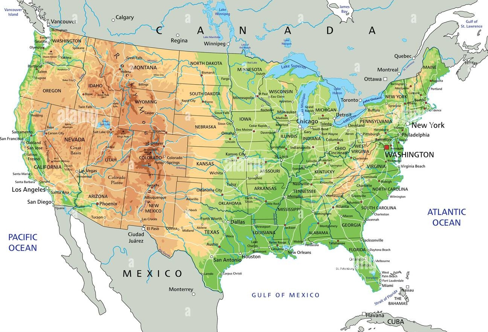

# Course admin

## Office hours {.medium .scrollable}

| Mug                   | Name        | Role       | Office Hours  |
|-----------------------|-------------|------------|---------------|
| {.c} | Hu, Yuang   | TA         | Mon 7:30 PM - 9:30 PM           |
| {.c} | Liu, Aurora | Head TA    | WeTh 4:30 pm - 5:30 pm |
| {.c} | Ma, Liane   | TA         | Sun 10:00 am - 12:00 pm |
| {.c} | Zito, John  | Instructor | Tue 3:00 pm - 6:00 pm |
: {tbl-colwidths="[20,20,20,40]"}

# Last time

## Set operations

| Set | Picture | Logic |
|---------------|-----------------|---------------|
| $A\cup B$             | {width="60%"} | (inclusive) OR |
| $A\cap B$             | {width="70%"} | AND |
| $A^c$                 | {width="60%"} | NOT |

## Algebraic properties {.medium}

$$
\begin{matrix}
    \text{Commutative} & A\cup B=B\cup A\\
    & A\cap B=B\cap A\\
    &\\
    \text{Associative} & (A\cup B)\cup C = A\cup (B\cup C)\\
    & (A\cap B)\cap C = A\cap (B\cap C)\\
    &\\
    \text{Distributive} & (A\cup B)\cap C = (A\cap C)\cup (B\cap C)\\
    &(A\cap B)\cup C = (A\cup C)\cap (B\cup C)\\
    &\\
    \text{De Morgan's Laws} & (A\cup B)^c=A^c\cap B^c\\ 
    & (A\cap B)^c=A^c\cup B^c.
\end{matrix}
$$

# Probability time

## Random phenomena {.scrollable}

::: incremental
- the outcome of a coin flip;
- the outcome of a die roll;
- the Poker hand dealt to you from a shuffled deck;
- the outcome of a presidential election;
- whether or not a basketball player makes a free throw shot;
- whether or not my soufflé falls in the oven;
- whether or not the opera singer hits the high note;
- the next song in your Spotify shuffle;
- the next word generated by ChatGPT;
- the birth weight of a newborn child;
- the number of costumers that will arrive at a store or restaurant on a given day;
- when and where a hurricane will make landfall;
- the time until an unstable particle will decay;
- the number of claims an insurance company receives in a month;
- the bid-ask spread of Google stock at 2:37 pm ET next Wednesday.
:::

. . .

Why are these things random?

## Sample spaces

The set of possible outcomes of a random phenomenon:

. . .

<table>
  <thead>
    <tr>
      <th>Phenomenon</th>
      <th>Sample space $S$</th>
    </tr>
  </thead>
  <tbody>
    <tr class="fragment">
      <td>Flip two coins in order</td>
      <td>$\{HH,\:HT,\:TT,\:TH\}$</td>
    </tr>
    <tr class="fragment">
      <td>Roll a single die</td>
      <td>$\{1,\:2,\:3,\:4,\:5,\:6\}$</td>
    </tr>
    <tr class="fragment">
      <td>Card dealt from a shuffled deck</td>
      <td>$\{2\clubsuit,\,3\clubsuit,\,4\clubsuit,\,\ldots\}$</td>
    </tr>
    <tr class="fragment">
      <td>Winning party in US election</td>
      <td>$\{\text{R}, \text{D}, \text{L}, \text{G}, ..., \text{DSA}\}$</td>
    </tr>
    <tr class="fragment">
      <td>Your blood sodium level in mEq/L</td>
      <td>$\mathbb{R}_+=(0,\infty)$</td>
    </tr>
    <tr class="fragment">
      <td># of insurance claims in a week?</td>
      <td>$\mathbb{N}$</td>
    </tr>
    <tr class="fragment">
      <td>Return on a risky asset</td>
      <td>$\mathbb{R}$</td>
    </tr>
  </tbody>
</table>

## Events

A subset $A\subseteq S$ of the sample space:

<table>
  <thead>
    <tr>
      <th>Description</th>
      <th>Event $A$</th>
    </tr>
  </thead>
  <tbody>
    <tr class="fragment">
      <td>“the first of two coin flips is a head”</td>
      <td>$\{HH,\:HT\}$</td>
    </tr>
    <tr class="fragment">
      <td>“the die is even”</td>
      <td>$\{2,\:4,\:6\}$</td>
    </tr>
    <tr class="fragment">
      <td>“dealt a four”</td>
      <td>$\{4\clubsuit,\,4\heartsuit,\,4\spadesuit,\,4\diamondsuit\}$</td>
    </tr>
    <tr class="fragment">
      <td>“right-wing party wins”</td>
      <td>$\{\text{R},\,\text{L},\,...\}$</td>
    </tr>
    <tr class="fragment">
      <td>“blood sodium in healthy range”</td>
      <td>$[133,\:145]$</td>
    </tr>
    <tr class="fragment">
      <td>“over a thousand claims”</td>
      <td>$\{1001,\,1002,\,1003,\,\ldots\}$</td>
    </tr>
    <tr class="fragment">
      <td>“your investment loses money”</td>
      <td>$(-\infty,\:0)$</td>
    </tr>
  </tbody>
</table>

# Translating set theory into probability

## Running example: where will the meteor land? {.small .scrollable}

The sample space is the set of all (long, lat) coordinates in this spatial region:

. . .

{fig-align="center" width="80%"}

## Example events

| Symbol | Description                                   |
|--------|-----------------------------------------------|
| $A$    | “Meteor lands in the United States”           |
| $B$    | “Meteor lands in Canada”                      |
| $C$    | “Meteor lands in Mexico”                      |
| $D$    | “Meteor lands in adjacent waters” |
| $E$    | “Meteor lands in the Rocky Mountains”         |

## "OR" events (union) {.small}

| Symbol | Description                                   |
|--------|-----------------------------------------------|
| $A$    | “Meteor lands in the United States”           |
| $B$    | “Meteor lands in Canada”                      |
| $C$    | “Meteor lands in Mexico”                      |
| $D$    | “Meteor lands in adjacent waters” |
| $E$    | “Meteor lands in the Rocky Mountains”         |

- “Meteor lands in the US **or** Canada”  
  → $A \cup B$

- “Meteor lands in Mexico **or** adjacent waters”  
  → $C \cup D$

- “Meteor lands in the Rocky Mountains **or** Canada”  
  → $E \cup B$
  
- “Meteor lands in North America”  
  → $A\cup B\cup C$

## "AND" events (intersection) {.small}

| Symbol | Description                                   |
|--------|-----------------------------------------------|
| $A$    | “Meteor lands in the United States”           |
| $B$    | “Meteor lands in Canada”                      |
| $C$    | “Meteor lands in Mexico”                      |
| $D$    | “Meteor lands in adjacent waters” |
| $E$    | “Meteor lands in the Rocky Mountains”         |

- “Meteor lands in the Rocky Mountains **and** the US”  
  → $E \cap A$

- “Meteor lands in the US **and** Mexico”  
  → $A \cap C = \varnothing$

- “Meteor lands in North America **and** adjacent waters”  
  → $(A \cup B \cup C) \cap D = \varnothing$

## "NOT" events (complement) {.small}

| Symbol | Description                                   |
|--------|-----------------------------------------------|
| $A$    | “Meteor lands in the United States”           |
| $B$    | “Meteor lands in Canada”                      |
| $C$    | “Meteor lands in Mexico”                      |
| $D$    | “Meteor lands in adjacent waters” |
| $E$    | “Meteor lands in the Rocky Mountains”         |

- “Meteor does **not** land in the US”  
  → $A^c$

- “Meteor does **not** land in the Rocky Mountains”  
  → $E^c$

- “Meteor does **not** land on land at all”  
  → $(A \cup B \cup C)^c = D$

## Implication {.small}

| Symbol | Description                                   |
|--------|-----------------------------------------------|
| $G$    | “Meteor lands in Georgia”           |
| $S$    | “Meteor lands in The South”        |
| $U$    | “Meteor lands in the United States”   |
| $N$    | “Meteor lands in North America” |

. . .

Notice:

. . .

$$
G\subseteq S\subseteq U\subseteq N.
$$

::: incremental
- If we learn that the meteor landed in The South, that implies that it landed in the USA, which implies that it landed in North America;
- It may or may not have landed in Georgia.
:::

## Summary

| **Probability**                | **Set theory**        |
|--------------------------------|-----------------------|
| $A$ or $B$ occur               | $A\cup B$             |
| $A$ and $B$ occur              | $A\cap B$             |
| $A$ does not occur             | $A^c$                 |
| $A$ implies $B$                | $A\subseteq B$        |
| $A$ and $B$ mutually exclusive | $A\cap B=\varnothing$ |
