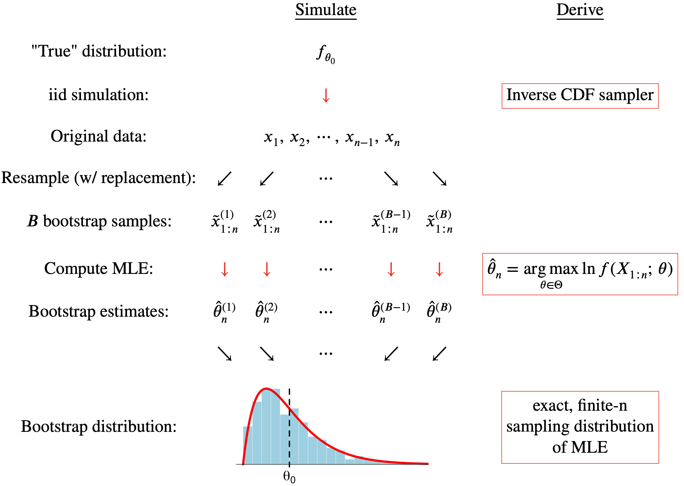

```{r}
#| echo: false
set.seed(123456)
```

# Our dirty little secret

## You do not learn `R` in 101, 199, etc

::: incremental
- `R` is a programming language, just like `Python`, `C++`, `Julia`, etc. 
- It has inheritance, objects, control flow, all that CS stuff;
- Stats majors must take STA 323, where you learn all that;
- In 199, we suppress the programming language side of `R` and teach you a narrow *dialect* called the "tidyverse," which is very well-suited to data science, especially for beginners;
- But we aren't doing *any* data science in this class, so now what?
:::

## Our computing needs

We will use R as a labor-saving technology to perform three kinds of tasks:

- calculator (`choose`, `factorial`, `dbinom`, etc);
- basic graphics (histogram, line plot, etc);
- but most important: ***simulation***.

## Why is simulation so important?

- This class is primarily about *doing the math* to understand how random phenomena behave;
- But when you cannot do the math, you can still simulate to approximate the behavior you are studying;
- This is a powerful tool for building intuition and prototyping mathematical ideas;
- Every statistician I know is constantly running simulations to understand how statistical methods behave, and we want you to be able to do the same thing.

## Where are we headed? {.scrollable}

- The mathematical and computational arcs of this class will converge to an analysis of *the bootstrap*;
- This is a simulation-based method for approximating the sampling distribution of a statistical estimator;
- Many of you used this procedure *on faith* in 101 or 199;
- In this class we want to explain what it's doing, why it works, and implement it ourselves.

## The Full Monty {.scrollable}



## The goal

- If by December you can understand every ingredient in that picture and how they fit together, then you have mastered the main ideas of this class and you are well prepared for the rest of the major;
- That diagram is a *template* for a generic kind of simulation that you can design to investigate the properties of *any* statistical method;
- It's a very powerful way of thinking, and we want you to be able to do it on your own.

## This will take a while!

- (10/01) Lab 5: Lock down R basics;
- (10/15) Lab 6: Continuous random variables;
- (10/22) Lab 7: Transformations;
- (10/29) Lab 8: Random number generation;
- (11/05) Lab 9: More random number generation;
- (11/19) Lab 10: Simulation + statistics;
- (12/03) Lab 11: The bootstrap!

# Meet R, the overgrown calculator

## The basics

```{r}
2 + 2 # addition
5 - 2 # subtraction
0.5 * 6 # multiplication
3 / 4 # division
sqrt(2) # square root
4 ^ 2 # exponent
```

## The (slightly less) basics

```{r}
exp(4.9) # base-e exponent
log(7) # natural log
ceiling(4.6) # round up
floor(4.6) # round down
factorial(4) # n! = n x (n-1) x ... x 2 x 1
choose(8, 3) # binomial coefficient
```

## From Problem Set 1

If $X\sim\text{Poisson}(\lambda=4)$, then 

$$
P(X\text{ even}) = e^{-4}\sum\limits_{i=0}^\infty\frac{4^{2i}}{(2i)!}=e^{-4}\cosh 4.
$$

. . .

```{r}
exp(-4) * cosh(4)
```

## From the infamous Lab 2 {.small}

> a five-card hand is randomly dealt to you from a well-shuffled deck. What is the probability that the hand contains at least one ace?

$$
P\left(\begin{matrix}\text{at least}\\\text{one ace}\end{matrix}\right)=1 - P(\text{no ace})=1-\frac{\#(\text{no ace})}{\#(\text{five card hands})}=1-\frac{\binom{48}{5}}{\binom{52}{5}}.
$$

. . .

```{r}
1 - choose(48, 5) / choose(52, 5)
```

# Vectors

## Vectors

- A *vector* in R is just an ordered collection of values that have the same type;
- The vector is the fundamental building block in R;
- Most data structures you see either *are* vectors or are made up of vectors;
    - Example: a *data frame* is just a bunch of vectors glued together.

## Vectors {.medium}

Many ways to construct a vector:

. . .

```{r}
c(pi, 5, 3.6, 2, 9, 6000) 
```

. . .

```{r}
5:15
```

. . .

```{r}
seq(0, 1, length.out = 11) 
```

. . .

```{r}
numeric(10)
```

. . .

```{r}
c("Mary", "had", "a", "little", "chainsaw")
```

## Variable assignment

It helps to give things a name so you can work with them later:

```{r}
x <- c(6, pi, sqrt(2), exp(1), 0)
x
```

`<-` is called the assignment operator. You should now see `x` listed in the "cast of characters" (*Environment*) in the upper right.

## About variable names

You can pick whatever name you want, but:

- Only numbers, letters, and `_` (underscore);
- The name must be a single unbroken phrase;
    - ❌ `prob mass`
    - ✅ `prob_mass`
- The first character cannot be a number;
- `R` is case sensitive;
    - `Prob_Mass` is different from `prob_mass`.

## Subsetting

If you want to isolate a *portion* of a vector, you can use bracket notation to request a subset of the elements:

```{r}
x

x[2]

x[c(1, 3, 5)]

x[1:3]
```

Each of these subsets is itself a *new* vector.

## Vectorization

Many commands in R are *vectorized*. This means that if you provide the command with a vector containing many inputs, it will return a vector containing many outputs. It will go element-by-element through the input, apply the command to each one separately, and then return all of the outputs to you bundled in a vector.

## Recall: center-of-mass example {.medium}

```{r}
#| echo: false
# ==============================================================================
# specify the distribution of the random variable
# ==============================================================================

range_X <- -6:2

mass <- c(3, 7, 6, 4, 4, 3, 3, 2, 1)

PMF <- mass / sum(mass)

# ==============================================================================
# plot the PMF
# ==============================================================================

plot(range_X, PMF, type = "h", xlim = c(-6, 6), lwd = 3, 
     xlab = "k",
     ylab = "P(X = k)",
     xaxt = "n",
     bty = "n")
axis(1, at = -6:6, labels = -6:6)
```

## Recall: center-of-mass example {.scrollable .medium}

I had a range:

```{r}
range_x <- -6:2
```

. . .

I had masses at each one:

```{r}
masses <- c(3, 7, 6, 4, 4, 3, 3, 2, 1)

sum(masses)
```

. . .

But they need to be normalized:

```{r}
probs <- masses / 33
probs
```

. . .

Division (`/`) is *vectorized*, so it knows to divide each mass by 33.

## Recall: center-of-mass example {.scrollable .medium}

The expected value is 

$$
E(X)=\sum\limits_{k=-6}^2 k \cdot P(X=k).
$$

. . .

Multiplication (`*`) is *vectorized*, so multiply each value by its probability:

```{r}
range_x * probs
```

. . .

Sum 'em up:

```{r}
EX <- sum(range_x * probs)
EX
```

## Recall: Problem Set 3 #8

$X$ is the inner product of two random binary strings:

$$
X=\sum\limits_{i=1}^{10}a_ib_i.
$$

Its pmf is 

$$
P(X=k)=\frac{\binom{10}{k}3^{10-k}}{2^{20}},\quad k = 0,\,1,\,2,\,...,\,10.
$$

## Recall: Problem Set 3 #8 {.scrollable .medium}

$$
P(X=k)=\frac{\binom{10}{k}3^{10-k}}{2^{20}},\quad k = 0,\,1,\,2,\,...,\,10.
$$

To compute all 11 of those probabilities in one fell swoop, take advantage of *vectorization*:

. . .

```{r}
k <- 0:10

pmf <- choose(10, k) * (3 ^ (10 - k)) / 2^20
pmf

sum(pmf)
```

# Sampling 

## Flip a coin

```{r}
sample(c("H", "T"), size = 10, replace = TRUE)
```

## Roll a die

```{r}
sample(1:6, size = 10, replace = TRUE)
```

## Shuffle a deck

```{r}
deck_of_cards <- c("AH", "2H", "3H", "4H", "5H", "6H", "7H", "8H", "9H", "10H", "JH", "QH", "KH",
                   "AD", "2D", "3D", "4D", "5D", "6D", "7D", "8D", "9D", "10D", "JD", "QD", "KD",
                   "AC", "2C", "3C", "4C", "5C", "6C", "7C", "8C", "9C", "10C", "JC", "QC", "KC",
                   "AS", "2S", "3S", "4S", "5S", "6S", "7S", "8S", "9S", "10S", "JS", "QS", "KS")

sample(deck_of_cards, size = 5, replace = FALSE)
```

## What about unequal outcomes?

From `?sample`:

```{r}
#| eval: false
sample(x, size, replace = FALSE, prob = NULL)
```

- `x`: a vector of one or more elements from which to choose;
- `size`: the number of items to choose;
- `replace`: should sampling be with replacement?
- `prob`: a vector of probability weights for obtaining the elements of the vector being sampled.

`x` and `prob` should probably be the same length!

## Recall: center-of-mass example {.medium}

```{r}
range_x <- -6:2
masses <- c(3, 7, 6, 4, 4, 3, 3, 2, 1)
pmf <- masses / sum(masses)

random_draws <- sample(range_x, 5000, replace = TRUE, prob = pmf)
random_draws
```

## Did it work? {.medium}

How many times did we see each value?

```{r}
table(random_draws)
```

. . .

What proportion of the time did we see each value?

```{r}
table(random_draws) / 5000
```

. . .

Are those close to the true probabilities?

```{r}
round(pmf, digits = 3)
```

## How does the computer do it?

How does the computer know how to generate draws from this distribution? What is it actually doing?

This is a fascinating, beautiful, and very important topic that we will spend several future labs on. Stay tuned!

# Basic plots

## Plotting a pmf {.small .scrollable}

Just a scatterplot: the first vector is the x-values; second vector is the y-values.

```{r}
range_x <- -6:2
masses <- c(3, 7, 6, 4, 4, 3, 3, 2, 1)
pmf <- masses / sum(masses)

plot(range_x, pmf, xlab = "k", ylab = "P(X = k)")
```

## Plotting a pmf {.small .scrollable}

Make it more pmf-ish with `type = "h"`:

```{r}
range_x <- -6:2
masses <- c(3, 7, 6, 4, 4, 3, 3, 2, 1)
pmf <- masses / sum(masses)

plot(range_x, pmf, type = "h", lwd = 3, xlab = "k", ylab = "P(X = k)")
```


## From Problem Set 0 #8

Plot this function from 2 to 15:

$$
f(x) = \frac{1}{x(\ln x)^{-1}}.
$$

## From Problem Set 0 #8

To plot a smooth curve, give it the formula (in terms of `x`) and connect the dots:

```{r}
curve(1 / (x * log(x) ^ -1), from = 2, to = 15, n = 1000, lwd = 3, col = "red")
```

## From Lab 4

For fixed $f_- = f_+=0.2$, plot these functions:

$$
\begin{aligned}
h(p)&=\frac{(1-f_-)p}{(1-f_-)p+f_+(1-p)},\\ 
g(p)&=\frac{p}{p+f_+}.
\end{aligned}
$$

## From Lab 4

```{r}
#| code-fold: true

f_plus = 0.2
f_minus = 0.2
curve(x / (x + f_plus),
      col = "blue",
      xlab = "p", 
      ylab = "", 
      xlim = c(0, 1),
      ylim = c(0, 1),
      main = paste("FNR = ", f_minus, "; FPR = ", f_plus))
curve(x / (x + f_plus * ((1 - x) / (1 - f_minus))),
      col = "red", add = TRUE)
legend("bottomright",
       c("True Probability", "Car Talk Answer"),
       col = c("red", "blue"),
       bty = "n",
       lty = c(1, 1)
       )
```

# New! the `pdqr` functions

## Parametric families 

We've begun studying famous *parametric* families of probability distributions:

| Distribution | Range | PMF: $P(X=k)$ | 
| --- | --- | --- |
| $X\sim\text{Binom}(n,\,p)$ | $\{0,\,1,\,2,\,...,\,n\}$ | $\binom{n}{k}p^k(1-p)^{n-k}$ |
| $X\sim\text{Geom}(p)$ | $\{1,\,2,\,3,\,...\}$ | $(1-p)^{k-1}p$ |
| $X\sim\text{Poisson}(\lambda)$ | $\mathbb{N}=\{0,\,1,\,2,\,3,\,...\}$ | $e^{-\lambda}\frac{\lambda^k}{k!}$ |

You will see *dozens* more by the end of the semester.

## The `pdqr` functions

R provides a standardized set of commands for working with each family of distributions:

- The `p` command computes the CDF (stay tuned!);
- The `d` command computes the PMF;
- The `q` command computes the quantile functions (stay tuned!);
- The `r` command simulates random numbers from the distribution.

## Example: binomial

For $X\sim\text{Binom}(\texttt{size},\,\texttt{prob})$, use:

```{r}
#| eval: false
dbinom(x, size, prob) # PMF: P(X = x)
rbinom(n, size, prob) # draw n random numbers
```

## Binomial: plot the pmf

```{r}
binom_range <- 0:6
binom_pmf <- dbinom(binom_range, 6, 0.4) # vectorized!

plot(binom_range, binom_pmf, type = "h", xlab = "k", ylab = "P(X = k)", lwd = 3)
```

## Binomial: compute probabilities

Recall from class that the probability of a random person liking my dating profile is $p=0.0162$. If $X\sim\text{Binom}(25,\,p)$ counts the number of matches I receive back today in 25 attempts, what is $P(X>0)$?

. . .

Finite additivity:

$$
\begin{aligned}
P(X>0)
&=
P(X=1\text{ or }X=2\text{ or }...\text{ or }X = 25)
\\
&=
P(X=1)+P(X=2)+...+P(X = 25)
\\
&=
\sum\limits_{k=1}^{25}P(X=k)
\\
&=
\sum\limits_{k=1}^{25}\texttt{dbinom(k, 25, 0.0162)}
.
\end{aligned}
$$

## Binomial: compute probabilities

```{r}
probs_1_to_25 <- dbinom(1:25, 25, 0.0162)
probs_1_to_25

sum(probs_1_to_25)
```

## Binomial: compute probabilities

Recall from class that the probability of a random person liking my dating profile is $p=0.0162$. If $X\sim\text{Binom}(25,\,p)$ counts the number of matches I receive back today in 25 attempts, what is $P(X>0)$?

. . .

Complement rule:

$$
P(X>0) = 1 - P(X = 0) = 1 - \texttt{dbinom(0, 25, 0.0162)}.
$$

. . .


```{r}

prob_0 <- dbinom(0, 25, 0.0162)

1 - prob_0
```

Same number as before. 


## Binomial: simulate and verify

Simulate $X\sim\text{Binom}(25,\,0.0162)$ a bunch and verify that the empirical proportions are close to the true probabilities. 

```{r}
random_draws <- rbinom(5000, 25, 0.0162)

table(random_draws) / 5000
```

. . .

```{r}
round(dbinom(0:7, 25, 0.0162), digits = 4)
```


## Example: Poisson

For $X\sim\text{Pois}(\texttt{lambda})$, use:

```{r}
#| eval: false
dpois(x, lambda) # PMF: P(X = x)
rpois(n, lambda) # n random numbers
```

## Poisson: plot the pmf

If $X\sim\text{Poisson}(\lambda = 100)$, then 

```{r}
pois_range <- 0:140
pois_pmf <- dpois(pois_range, 100)

plot(pois_range, pois_pmf, type = "h", xlab = "k", ylab = "P(X = k)")
```

## Poisson: compute probabilities {.small}

Say that $X\sim\text{Poisson}(\lambda = 100)$ represents the number of claims an insurance company receives in a month. What is the probability that they receive an above-average number of claims?

. . .

$$
\begin{aligned}
P(X > E(X)) = P(X > \lambda)
&=P(X>100) = \sum\limits_{k=101}^\infty P(X=k) && (\text{ick!})
\\
&=
1-P(X\leq 100)
=
1 - \sum\limits_{k=0}^{100} P(X=k)
&& (\text{yay!})
\end{aligned}
$$

## Poisson: compute probabilities

```{r}
prob_below_average <- sum(dpois(0:100, 100))

1 - prob_below_average
```

## Poisson: compute probabilities 

If $X\sim\text{Poisson}(\lambda=4)$, then $P(X\text{ even})\approx 0.5001677$.

Verify:

```{r}
evens <- seq(0, 100, by = 2)

sum(dpois(evens, 4))
```

## Poisson: simulate and verify {.scrollable .medium}

Simulate $X\sim\text{Poisson}(\lambda = 100)$ a bunch and verify that the empirical proportions are close to the true probabilities. 

```{r}
random_draws <- rpois(5000, 100)

table(random_draws) / 5000
```

## Poisson: simulate and verify {.scrollable .medium}

Clearly we didn't visit every possible natural number. Which ones did we see?

```{r}
sort(unique(random_draws))
```

What are their probabilities?

```{r}
probs <- round( dpois(sort(unique(random_draws)), 100), digits = 4)
probs
```

Close? 


```{r}
props <- table(random_draws) / 5000

cbind(probs, props)
```

# One more thing

## LaTeX! {.medium}

- This is new for most of you, and has been causing some headache;
- But if you major in a mathematical discipline, you need to know it;
- I create all of the course materials using Quarto + R + LaTeX;
- You would not want to write [this](/math/series.html) in Google Docs.

## Example: binomial pmf

What you type in your Quarto doc:

```
$$
P(X = k) = \binom{n}{k} p^k (1-p)^{n - k}.
$$
```

What appears in the rendered `.pdf`:

$$
P(X = k) = \binom{n}{k} p^k (1-p) ^{n - k}.
$$

## Example: Poisson pmf

What you type in your Quarto doc:

```
$$
P(X = k) = e^{-\lambda} \frac{\lambda^k}{k!}.
$$
```

What appears in the rendered `.pdf`:

$$
P(X = k) = e^{-\lambda} \frac{\lambda^k}{k!}.
$$

## Example: gamma function

What you type in your Quarto doc:

```
$$
\Gamma(x) = \int_0^\infty z^{x-1} e^{-z} dz.
$$
```

What appears in the rendered `.pdf`:

$$
\Gamma(x) = \int_0^\infty z^{x-1} e^{-z} dz.
$$

## Example: our heavy-tailed friend

What you type in your Quarto doc:

```
$$
\sum\limits_{n=0}^\infty n\frac{6}{\pi^2n^2} = \infty.
$$
```

What appears in the rendered `.pdf`:

$$
\sum\limits_{n=0}^\infty n\frac{6}{\pi^2n^2} = \infty.
$$

## Pro-tips

- A math chunk begins with `$$` and ends with `$$`. Make sure you have line breaks immediately before the start of the math chunk and immediately after;
- *Within* the math chunk, do not have any empty lines. You'll get a dumb render error;
- Spread your expression across multiple lines to make it a little more readable.

## Example: bell curve (Problem Set 0)

:::: columns
::: column

What you type:

```
$$
h(x)
=
\exp
\left(
-\frac{1}{2}
\frac{(x-\mu)^2}{\sigma^2}
\right)
.
$$
```

:::

::: column
How it renders:

$$
h(x)
=
\exp
\left(
-\frac{1}{2}
\frac{(x-\mu)^2}{\sigma^2}
\right)
.
$$
:::
::::


